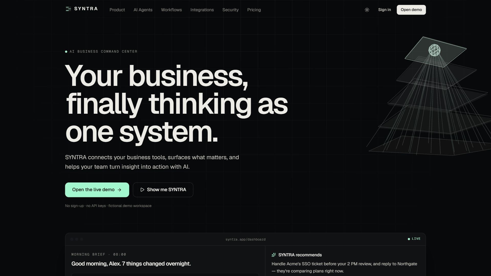
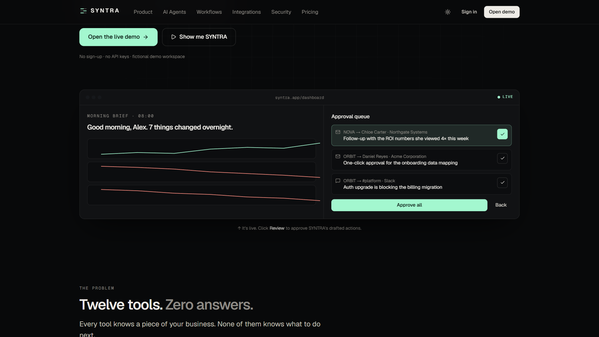
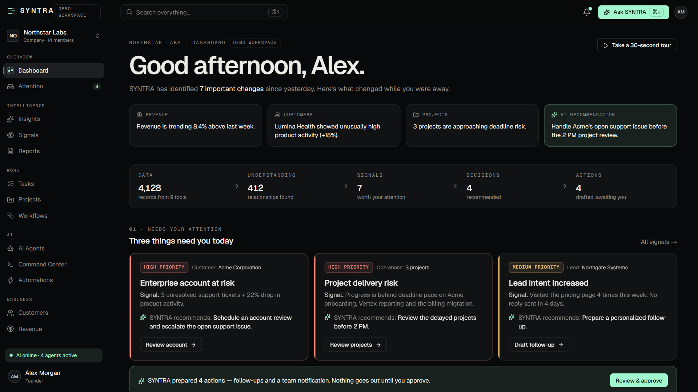
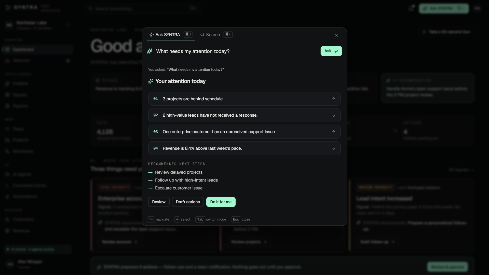
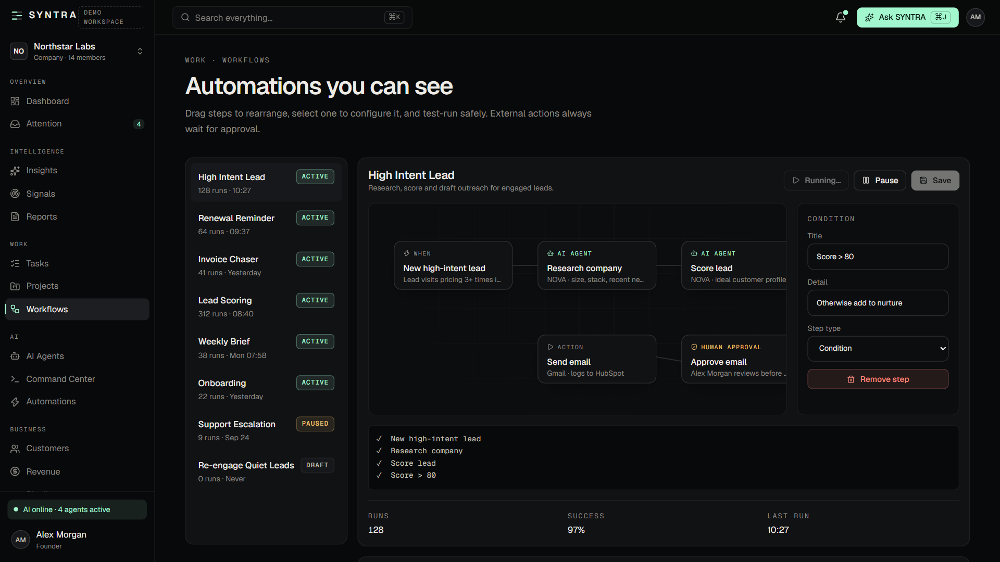
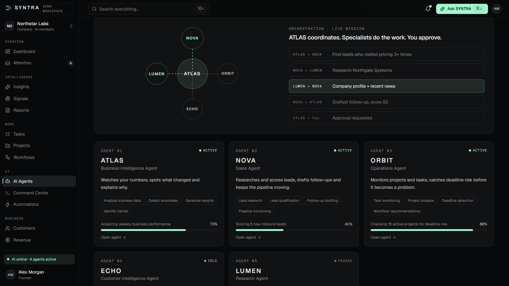

# SYNTRA — AI Business Command Center Template

**Your business, finally thinking as one system.** SYNTRA is a premium AI SaaS template: a marketing site plus a complete AI business dashboard. It runs fully in demo mode, with no API keys or backend.

**[Live demo](https://syntra-muad1.vercel.app)** · **[Get the template ($49)](https://muadme.gumroad.com/l/qamgrq)**

## What's inside

- **Interactive landing page.** The first click on **Review** shows the core loop: the AI drafts actions, you approve, and it's logged.
- **"Show me SYNTRA".** A 20-second full-screen product story you can pause, skip, or step through with the arrow keys.
- **22-route dashboard app:**
  - Overview: dashboard, attention inbox
  - Intelligence: insights, signals, reports, executive brief
  - Work: tasks (drag and drop), projects, workflows, automations
  - AI: AI agents, command center
  - Business: customers, revenue, pipeline
  - System: integrations, activity, audit log, settings
- **AI command palette** (Ctrl/⌘ K to search, Ctrl/⌘ J to ask). Answers come back as structured views: risk lists, schedules, opportunities, generated workflows.
- **Human-in-the-loop approvals.** Every AI action goes to an approval queue (approve, edit or reject) and is written to an exportable audit log.
- **Visual workflow builder.** Drag steps, edit them, test-run, or describe a workflow in plain English.
- **Five AI agents** with memory, tools, permissions and a live activity stream.
- **Roles and permissions.** Preview the app as Founder, Admin, Manager or Member.
- **Also:** dark and light themes, mobile bottom navigation, and a lazy-loaded 3D hero.

## Built with

React 19 · TypeScript · Tailwind CSS v4 · Vite · Framer Motion · React Three Fiber · React Router

- One config file for brand, navigation, pricing and roles. Theme colours are CSS variables.
- A typed mock AI layer you can swap for a real model provider.
- Lighthouse: desktop performance 98. Accessibility, Best Practices and SEO 100.

## More templates

- [VANTA DETAIL](https://github.com/Muaddd1/VANTA-DETAIL) — automotive detailing template with a scroll-driven 3D car, a live quote builder and a seven-step booking flow ([demo](https://vanta-detail-muad1.vercel.app))
- [NEXFORM](https://github.com/Muaddd1/NEXFORM) — futuristic personal-trainer template with a 3D athlete, a personalisation quiz, a 3D body map and a real booking flow ([demo](https://nexform-muad1.vercel.app))
- [FADEHOUSE](https://github.com/Muaddd1/FADEHOUSE) — premium barbershop template with a real booking flow and a 3D clipper built in code ([demo](https://fadehouse-muad1.vercel.app))
- [ÉLORA](https://github.com/Muaddd1/ELORA) — luxury beauty-salon template with a real booking flow and a 3D serum bottle ([demo](https://elora-muad1.vercel.app))
- [VELLUTO](https://github.com/Muaddd1/VELLUTO) — cinematic 3D coffee-brand template with a scroll-driven espresso cup ([demo](https://velluto-muad1.vercel.app))
- [AURELIA](https://github.com/Muaddd1/AURELIA) — luxury e-commerce React template ([demo](https://aurelia-template-phi.vercel.app))
- [VANTA](https://github.com/Muaddd1/VANTA) — premium digital-product storefront template ([demo](https://vanta-creator-os.vercel.app))
- [AURUM](https://github.com/Muaddd1/AURUM) — luxury gold jewelry template with a live gold price calculator and Arabic RTL ([demo](https://aurum-template-muad1.vercel.app))
- [PLINTH](https://github.com/Muaddd1/PLINTH) — single-file interior design studio template ([demo](https://plinth-template.vercel.app))
- [GOLDEN CRUST](https://github.com/Muaddd1/GOLDEN-CRUST) — pizza restaurant template with a 3D pizza hero ([demo](https://golden-crust-muad1.vercel.app))

## About this repository

This is a showcase repository: it holds screenshots only. The full source code is available on **[Gumroad](https://muadme.gumroad.com/l/qamgrq)**.

All company names, people and figures in the demo are fictional.

---

Built by [Mouad Sehli](https://github.com/Muaddd1).
